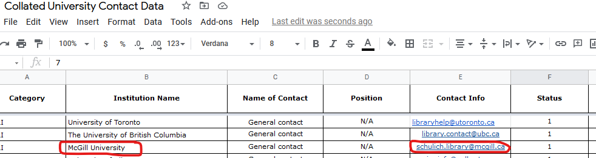
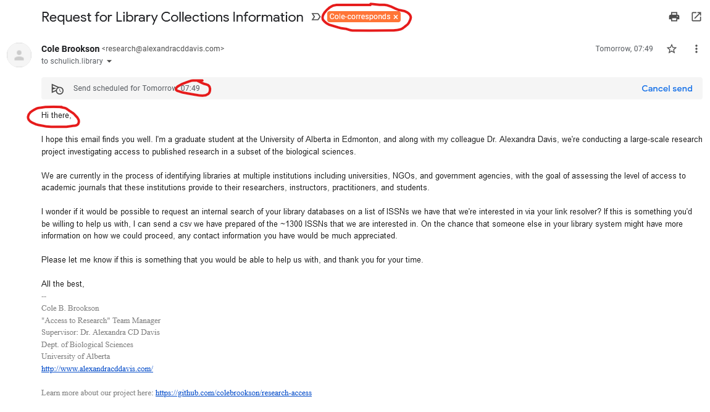
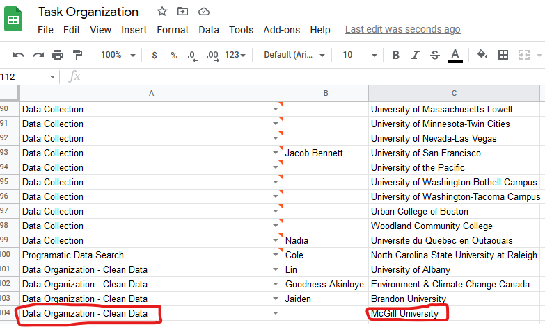
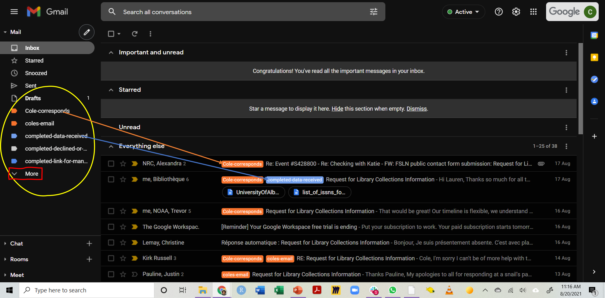
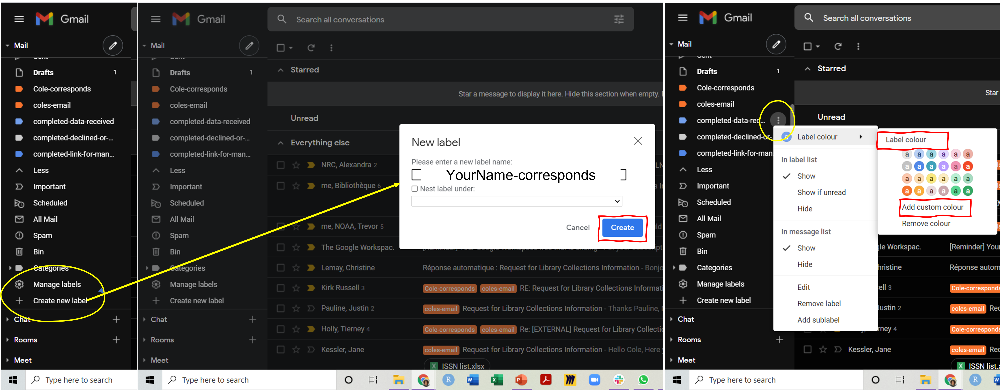
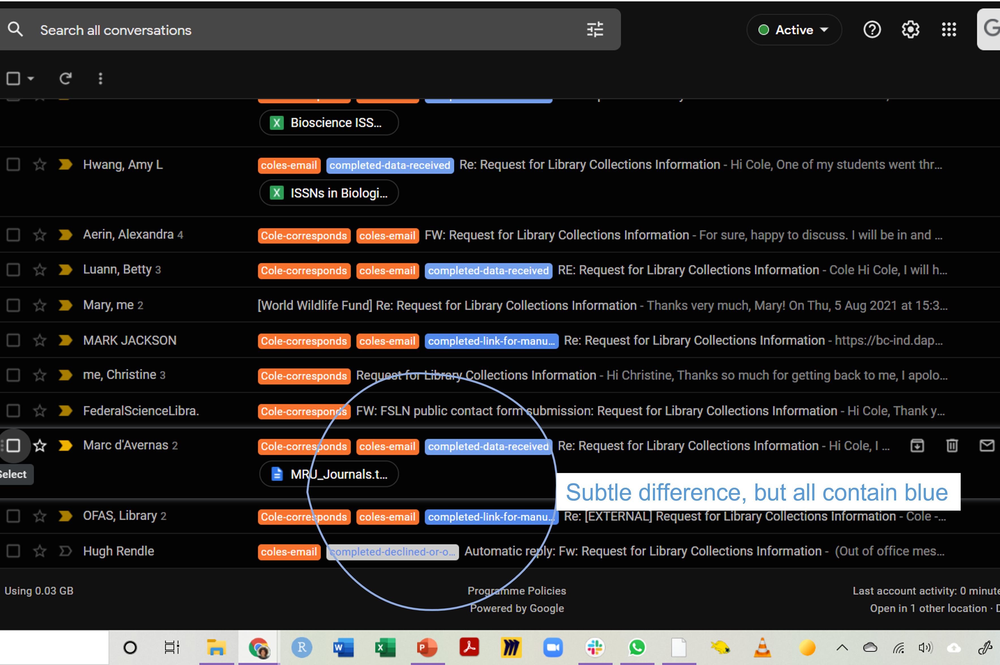

# Contact Protocol for Institutions

If you are emailing an institution, this document will serve as your primary guide on how to do so. To start off, ensure that you have access to the following resources: 

* The email address *research@alexandracddavis.com* 
* The university contact sheet: *Collated University Contact Data*
* The Gov/NGO contact sheet: *Collated Gov/NGO Contact Sheet*

Before you send any emails, look through the existing emails that have already been sent to get a handle on some common exchanges/questions/patterns that cases have displayed thus far. Also, look through the various stock emails (at the bottom of this document) to familiarize yourself with how we can respond to different cases. 

--------------------------------------------------------------------------------
--------------------------------------------------------------------------------
## The Contact Process
--------------------------------------------------------------------------------
--------------------------------------------------------------------------------

For the purposes of this example, we'll refer to the process of contacting a single institution as a *case*. There are four main steps in the contact process: 

1. Initial Contact
2. Ongoing Liasing 
3. Data Acquisition
4. Case Conclusion

--------------------------------------------------------------------------------
### 1. Initial Contact
--------------------------------------------------------------------------------

* In either of the contact sheets, find the case you need to contact. All cases with `Status = 1` need to be actioned. For example, McGill University - identify the case in the contact sheet, and find the contact info: 



* Once you have found the contact info, navigate to the Gmail account and first check to ensure there hasn't already been any correspondence with this email (mistakes happen!)
* If there is no existing correspondance, begin a new message. Using the stock email for a first contact (found at the bottom of this doc), create a new message to this new contact and send out the email. 
    **Important Notes**

    - Always address emails to general addresses (i.e. *schulich.library@mcgill.ca*) as "*Hi there,*"
    - Always address emails to specific people by their last names (i.e. "*Dear Dr. Soandso,*"), and remember to double check spelling!! and even if you have reason to believe they're not a Doctorate, address them as Dr. - it's gender nuetral and doesn't assume a position lower than that they might have. They'll correct you if they would prefer; most people will just ask to be called by their first names. If they do, refer to them how they ask to be referred to 



* Send emails in the MORNING always! If you are working at a different time, use the schedule send function via the "down" arrow beside the "Send" button, to schedule a time - **initial emails should always be sent on weekdays, and should be scheduled to go out at 7:49AM EST**

* Once the email is sent/scheduled, add a label with your name (as the `Cole-corresponds` example here)

* Change the contact sheet information with the relevant information:
    * The `Status` column should now read `6` which codes for "Waiting for Response"
    * Change the `Contacted?`, `Date Contacted` and `Contact Individual` columns to reflect the relevant information (note: contact individual is you)

First step done :)  

--------------------------------------------------------------------------------
### 2. Ongoing Liasing 
--------------------------------------------------------------------------------

This tends to be the longest part of the process. Typically about 50% of institutions will respond promptly (w/in 3-5 business days). 

If the given institution *does* respond, they will likely respond in one of three ways: 
1. They will agree to provide some type of help and may ask a few follow-up questions
2. They will decline any help, usually citing some capacity shortages
3. They will suggest they have limited capactiy to help, and will offer alternatives and/or ask for more details on what we need. 

Here is how to respond to each: 

#### 1. Some Type of Help 

An ideal form of response in this case looks like this: 

```
Good Afternoon Mr. Brookson,

Thank you for reaching out to the US Geological Survey Library.

We would be happy to participate, depending on the level of information you are seeking and our ability to comply.

I've copied Tami Morse, our Cataloging Librarian, she can help with the technical aspects of mining our catalog.
```

In this case, our job is easy - simply respond in a timely fashion, clarifying what exactly we're looking for and attaching the list of ISSNs in the `.csv` file. 

```
Hi Holly & Tami,

Thanks so much for getting back to me! That would be amazing. So essentially all we really need in terms of information is, for each ISSN, a) whether or not you have access, b) ideally the time you have access to the journal from (e.g. 1993-Present) and that's pretty much it. Would that be possible?

I've attached the list of ISSNs we're interested in here. Please let me know if there is any other information I can provide that would be helpful!

Thanks again!
Cole
**Attached file**
```

#### 2. Decline with no Help

Typically that type of email will look like the following:

```
Hi Mr. Brookson,

Unfortunately we do not have the staff nor resources to help you at this time. 

All the best in your research project. 

-Anita
```

Our goal now is not to make further asks that we are unlikely to be granted, but to find some way to get information from the institution. We want to offer two alternatives and hope they agree on the first but sometimes only will have the second: 

1. They agree to send us a batch file of their entire holdings collection OR
2. They have a link (i.e. somewhere on their library website) that we can look through ourselves 

So, a typical reply can look like this: 

``` 
Hi Anita,

Thanks so much for getting back to us. Completely understandable re: resources/staff. I have one quick follow-up question for you. 

I know you don't have the resources to help with the actual search, but I'm still wondering if it would be possible for us to get some data from your institution. 
One thing we've done with other institutions is they have just sent us a data dump of essentially their entire collection holdings information for us to sort through. 
With regardards to that, all we need is a list of all print/electronic periodical titles you have access to in full-text. We can search through that list programmatically to find the ISSNs we're interested in. 

If that's not possible, I wonder if as a last resort, there is somewhere on your library website you could direct me to where we could manually search for each ISSN ourselves?

Thanks so much,
Cole
```

If they agree to sending us a batch file, that's great! We thank them profusely, and turn that data over to the folks doing data cleaning to be dealt with. If they decline the first option but do give us a link, same process, thank them and turn over the link. 

#### 3. Suggest they have limited capactiy to help, and will offer alternatives 

This is usually the longest type of exchange we can have with institutions. Some have gone as far as giving us temporary log-in information so we can go into their library websites and find the information ourselves. These emails are VERY variable, but they will often propose a solution similar to the one we actually want which is to send us all of their collections information.

Again, we want ideally for them to accept our list of ISSNs, and return data on their access. If that's not possible, then a full list of their holdings is the next best thing. The third option of them just sending us a website link to search through ourselves is the worst option, but better than nothing. 

**Recall that at every stage of this process, you need to be updating the status code in the Contact sheet**

--------------------------------------------------------------------------------
### 3. Data Acquisition
--------------------------------------------------------------------------------

In the case that they agreed to give us data, either batch data or the ISSN-specific data, we need to deal with that once it comes into the email. 

We first go to the `Collected Data` folder in the Google Drive, and enter the `data from institutions` subfolder. Next, go into the `raw` subfolder (all these data need to be cleaned before they can be used). 

Since many institutions will send us multiple files, we always make a subfolder for the institution at hand. Keeping with our previous example, if we need to make a folder for McGill, we create a new folder called `McGill` (no spaces in any folder names!), and upload the data from Gmail to this folder. 

**As always, update the institution status at this point**

--------------------------------------------------------------------------------
### 4. Case Conclusion 
--------------------------------------------------------------------------------

Now, we've finished all our liasing with the institution, and we've changed the status inthe google sheet. *Importantly*, we have to make a new task in the `Task Organization` spreadsheet. To do this, simply add to the `Task` column and the `Institution (if applicable)` columns. 



Done! We've concluded the case! :)

--------------------------------------------------------------------------------
### Troubleshooting 
--------------------------------------------------------------------------------

You will 100% encounter a situation where a contact says something or asks a question and you don't know how to respond. **DO NOT PANIC :)**

Steps to troubleshoot:

1. *Read through previous exchanges.* It's possible someone has already posed that problem and and an answer has been given. 
2. *Ask in the `library-contact` channel*. No harm in asking! If someone else has fielded and answered a similar question they can chime in. If no one has yet, Cole will provide the information needed to address the issue. 

*Note it's always better to wait a few days to answer the email after clarifying what the response should be, then to respond quickly and then have to backtrack.*

--------------------------------------------------------------------------------
## Email Organization
--------------------------------------------------------------------------------
### Please check the slack channel for login information for the share email account


In order to keep things organzied in the share email account we will be using specific labels and colors to denote individuals.

Labels are organized alphabetically on the side panel in the email browser, and also appear in the list of emails.



To create a new label:
1. Click the "More" tab
2. Scroll down and click "Create new label" 
3. Enter "yourname-corresponds" into the type box and hit create
4. Designate your individual color
   * Click on the three dots
   * Hover over "Label Colour"
   * Pick your colour!



Please try and choose a distinct colour from the ones in use. You can even create your own label colour.

*Please note that Cole is associated wtih the colour orange, and any cases that are completed have some blue in the label*



--------------------------------------------------------------------------------
--------------------------------------------------------------------------------
## The Stock Emails
--------------------------------------------------------------------------------
--------------------------------------------------------------------------------

### Intial Email

* Change name as needed - use "Hi there" for general emails (i.e. no specific person)

`Subject: Request for Library Collections Information`
```
Dear Dr. Soandso/Hi there,

I hope this email finds you well. I'm a graduate student at the University of Alberta in Edmonton, and along with my colleague Dr. Alexandra Davis, we're conducting a large-scale research project investigating access to published research in a subset of the biological sciences. 

We are currently in the process of identifying libraries at multiple institutions including universities, NGOs, and government agencies, with the goal of assessing the level of access to academic journals that these institutions provide to their researchers, instructors, practitioners, and students. 

I wonder if it would be possible to request an internal search of your library databases on a list of ISSNs we have that we're interested in via your link resolver? If this is something you'd be willing to help us with, I can send a csv we have prepared of the ~1300 ISSNs that we are interested in. On the chance that someone else in your library system might have more information on how we could proceed, any contact information you have would be much appreciated.

Please let me know if this is something that you would be able to help us with, and thank you for your time. 

All the best,
```

### Response to Clear Offer for Help
------------------------------

Example Helpful Response from case: 
```
Good Afternoon Mr. Brookson,

Thank you for reaching out to the US Geological Survey Library.

We would be happy to participate, depending on the level of information you are seeking and our ability to comply.

I've copied Tami Morse, our Cataloging Librarian, she can help with the technical aspects of mining our catalog.

Thank you again,
Holly

Holly N Nickle
Acting Library Director & Chief, Public Services
U.S. Geological Survey Libraries Program
12201 Sunrise Valley Drive | Reston, VA 20192 USA
hnickle@usgs.gov  | Voice: 703.648.6207 
```
------------------------------
Our Response:
```
Hi Holly & Tami,

Thanks so much for getting back to me! That would be amazing. So essentially all  we really need in terms of information is, for each ISSN in our list, a) whether or not you have access, b) ideally the time you have access to the journal from (e.g. 1993-Present) and that's pretty much it. Would that be possible?

I've attached the list of ISSNs we're interested in here. Please let me know if there is any other information I can provide that would be helpful!

Thanks again!
Cole
```
`**Attach file of ISSNs**`

### Response to Decline 

Example declination: 
```
Hi Mr. Brookson,

Unfortunately we do not have the staff nor resources to help you at this time. 

All the best in your research project. 

-Anita
```
------
Our response:
``` 
Hi Anita,

Thanks so much for getting back to us. Completely understandable re: resources/staff. I have one quick follow-up question for you. 

I know you don't have the resources to help with the actual search, but I'm still wondering if it would be possible for us to get some data from your institution. 
One thing we've done with other institutions is they have just sent us a data dump of essentially their entire collection holdings information for us to sort through. 
With regardards to that, all we need is a list of all print/electronic periodical titles you have access to in full-text. We can search through that list programmatically to find the ISSNs we're interested in. 

If that's not possible, I wonder if as a last resort, there is somewhere on your library website you could direct me to where we could manually search for each ISSN ourselves?

Thanks so much,
Cole
```

